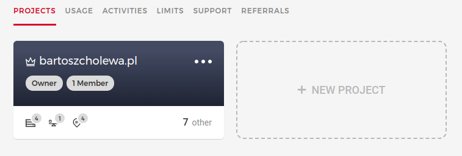
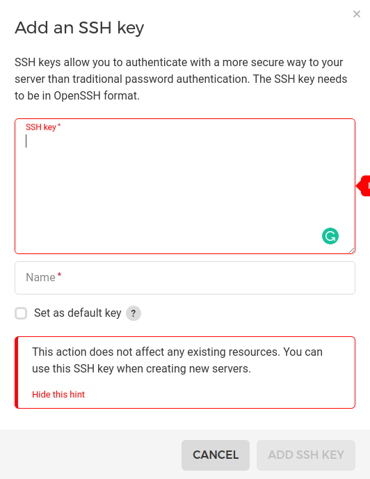
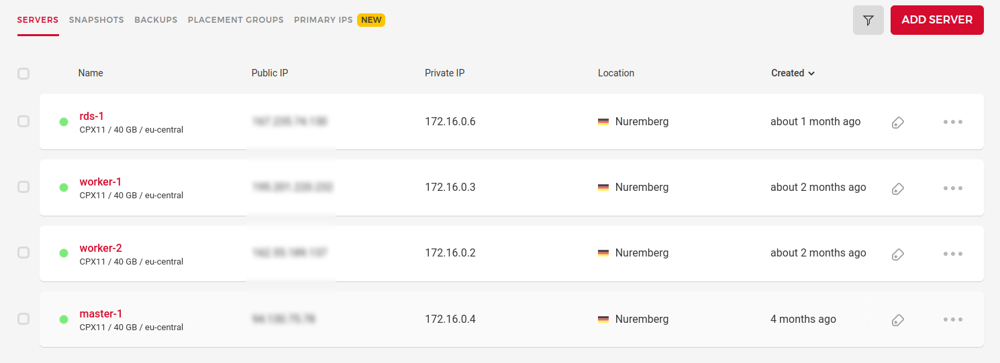

# Bartosz Cholewa Website - Backend

***

## 1. Server deployment - Hetzner

#### Install a Kubernetes-Cluster on Hetzner Cloud

### 1.1 Register to [Hetzner Cloud](https://accounts.hetzner.com/login)

### 1.2 Create new [project](https://console.hetzner.cloud/projects)

### 1.3 Add SSH keys to project

### 1.4 Add MASTER server to project:

1. Location: **Nuremberg**
2. Image: **Ubuntu 20.04**
3. Type: **Standard**
4. Servers: **CPX11** or greater
5. Volume: **None**
6. Networking: **Public IPv4**, **Public IPv6**, **Private networks**
7. Private Networks:
    1. Name: **kubernetes**
    2. IP Range: **172.16.0.0/16
8. Firewalls: **None**
9. Additional features: **Placement group**
10. Placement group:
    1. Type: **Spread**
    2. Name: **placement-group-1**
11. SSH Keys: **Previosly created**
12. Name: **master-1**

### 1.5 Repeat step **1.4.** for creating **worker-1**, **worker-2** and **rds-1**

